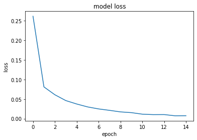

# lenet-5-on-mnist

The goal is to apply LeNet-5 on minist data and predict the handwritten digits. The preview of data follows:  

## Prerequisites:
Download the following modules:
* [Keras](https://pypi.org/project/tensorflow/) 
* [tensorflow](https://pypi.org/project/Keras/)
* [mnist_data](https://pypi.org/project/mnist/)

## Quick start:
* clone or download the repository and run le-net5.py  
     ` le-net5.py `
 
 ## LeNet-5 Architecture:
 
 
 LeNet-5 comprises of 7 layers, not counting the input layer as you can see in the graph above. MNIST images are 28x28 pixels which is smaller than what LeNet-5 expects 32x32 pixels. An easy solution to that is just to pad the images with zeros to bring the MNIST images size up to 32x32 pixels.  
 ### LeNet-5 layers:
1. Convolution #1. Input = 32x32x1. Output = 28x28x6 conv2d  
2. SubSampling #1. Input = 28x28x6. Output = 14x14x6. SubSampling is simply Average Pooling so we use avg_pool  
3. Convolution #2. Input = 14x14x6. Output = 10x10x16 conv2d  
4. SubSampling #2. Input = 10x10x16. Output = 5x5x16 avg_pool  
5. Fully Connected #1. Input = 5x5x16. Output = 120  
6. Fully Connected #2. Input = 120. Output = 84  
7. Output 10  
 
## Results:

* Train accuracy: 0.9979
* Test accuracy: 0.9876

